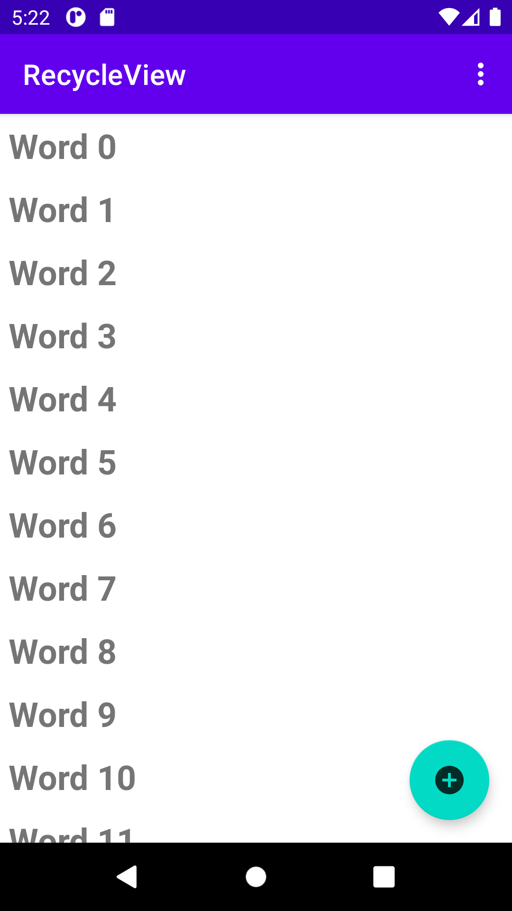
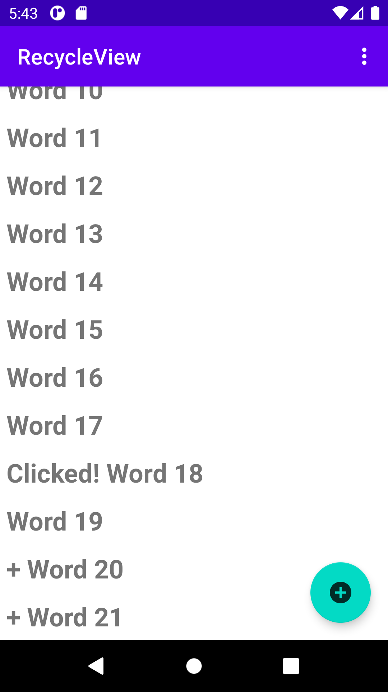

# RecyclerView
<b>Homework gif</b>
 

 
<b>Task2</b>
 

 
<b>Task3</b>
 

 
<b>Coding challenge</b>
 
Homepage
 

 
List
 

 
Added list
 

 
<b>Homework</b>
 
Homepage
 

 
Count and edit text used
 

